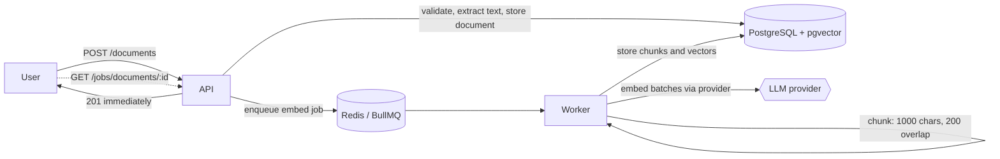
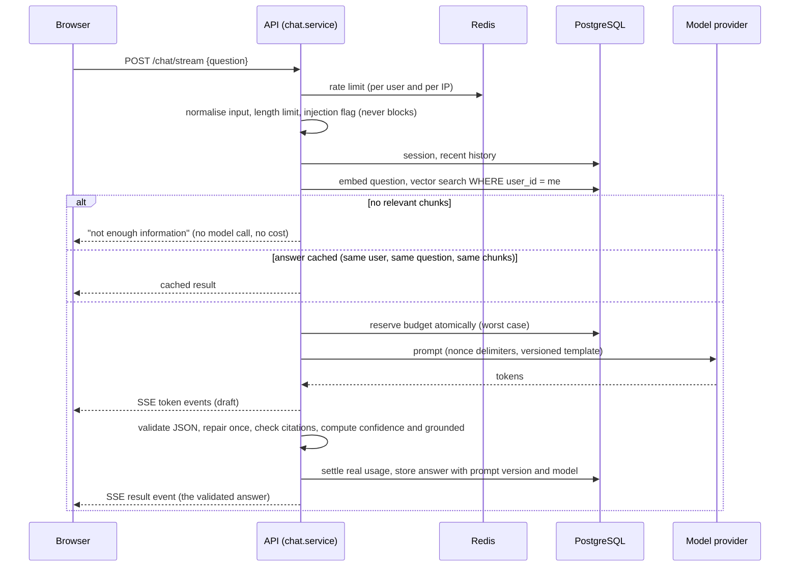

# Architecture

## The two flows

### 1. Ingestion (asynchronous)

The upload returns as soon as the text is stored. Chunking and embedding run on a worker, so a large upload cannot hold an HTTP request open or starve chat, and workers scale on their own. The UI polls the job status.

### 2. Question answering (streamed)

What the client sees while streaming is a **draft**. The final `result` event carries the validated answer, citations, confidence and the `grounded` flag, and the UI replaces the draft with it.

## The three AI stages are separate (brief 1.2)

| Stage | Where | Property |
|---|---|---|
| 1. Prompt construction | `backend/src/ai/prompts/` | Pure function. Versioned, immutable templates; untrusted text wrapped in per-request nonce delimiters |
| 2. Model invocation | `backend/src/ai/providers/` | `LlmProvider` interface; OpenAI, Anthropic, Mock. Retry with backoff, fallback, PII redaction are decorators around it |
| 3. Post-processing | `backend/src/ai/postprocessing/` | Pure. Schema validation (zod), citation check against the chunks given, confidence, `grounded` rule |

`ai/pipeline/chatPipeline.ts` only wires them together and does one repair attempt when the model breaks the output format. It knows nothing about HTTP or the database, which is what lets the eval runner and the tests use it directly.

## Components

| Component | Responsibility |
|---|---|
| `routes/` | HTTP shape, auth, validation, rate-limit middleware. No business logic |
| `services/` | Use cases: chat (orchestration), budget, audit, retention, auth, documents |
| `repositories/` | All SQL. Every query is scoped by `user_id` (tenant isolation) |
| `ai/` | Everything model related, described above, plus `pricing`, `responseCache`, `safety/` |
| `rag/` | Chunker, embeddings, retriever (pgvector HNSW, cosine), context builder |
| `workers/`, `queues/` | BullMQ embedding worker; scheduled retention job |
| `evals/` | Golden set and runner (`npm run eval`) |
| `frontend/` | React app: login, documents, chat with streaming states, history |

## Cross-cutting decisions

- **Multi-tenancy:** a tenant is a user. Every table that holds user data carries `user_id`, composite foreign keys stop a row from pointing at another tenant's parent, and foreign resources return 404 (not 403) so existence is not revealed. A route-inventory test fails if a new route is added without being covered.
- **Failure behaviour:** Redis rate limiting fails open (a Redis outage must not take chat down); the cost budget lives in Postgres and fails closed. A provider outage falls back to the second provider for completions; once tokens have started streaming there is no retry or fallback, because the user already saw part of an answer.
- **Observability:** structured logs (Pino) with a request id; they carry sizes, ids and timings, never prompts, answers or documents. Usage per request (model, tokens, cost, prompt version) is stored for cost analysis.
- **Shutdown:** on SIGTERM the server stops accepting connections, lets streams in flight finish (up to `SHUTDOWN_GRACE_MS`), then closes Redis and Postgres. A test starts a stream, sends SIGTERM and asserts it completes.

## Deployment shape

See [DEPLOYMENT.md](DEPLOYMENT.md): ALB, API and worker on ECS Fargate, RDS, ElastiCache, Secrets Manager.
